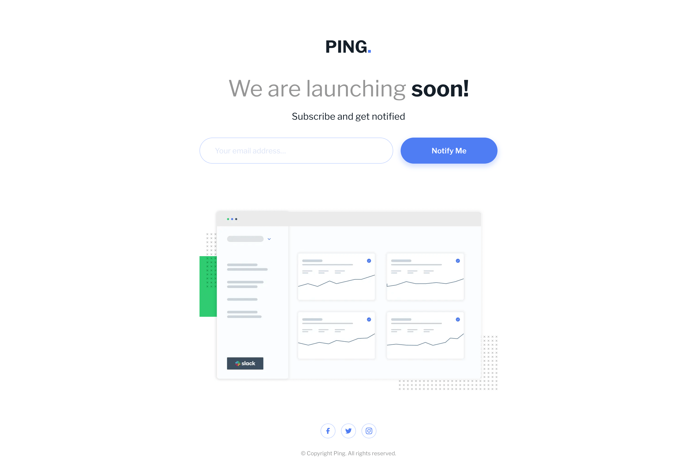
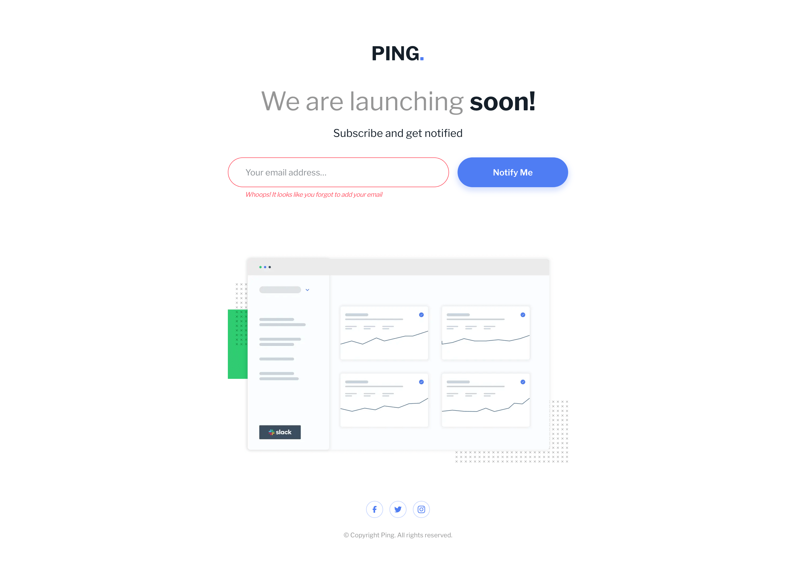
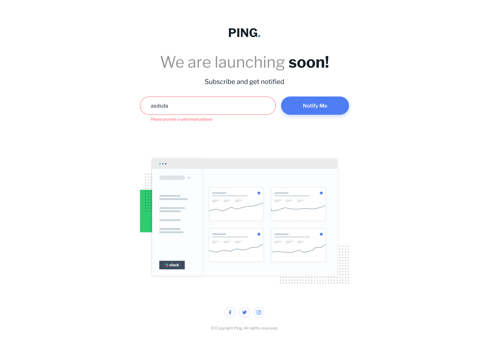
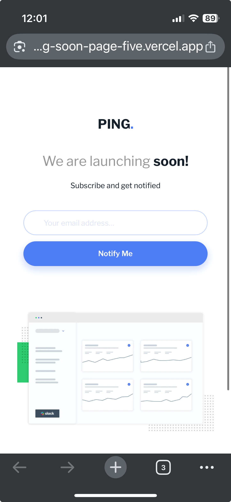
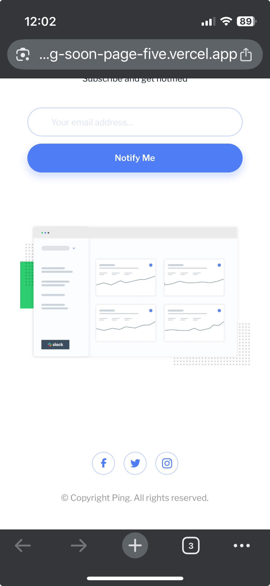
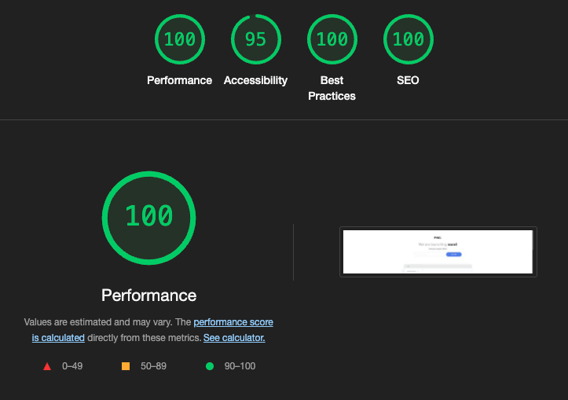
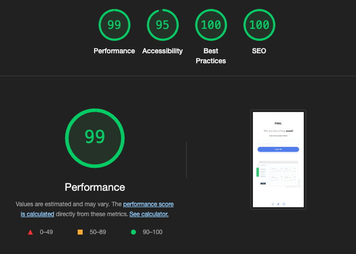

# Frontend Mentor - Ping coming soon page solution

This is a solution to the [Ping coming soon page challenge on Frontend Mentor](https://www.frontendmentor.io/challenges/ping-single-column-coming-soon-page-5cadd051fec04111f7b848da). Frontend Mentor challenges help you improve your coding skills by building realistic projects.

## Table of contents

- [Overview](#overview)
  - [The challenge](#the-challenge)
  - [Screenshots](#screenshots)
  - [Links](#links)
- [My process](#my-process)
  - [Built with](#built-with)
  - [What I learned](#what-i-learned)
  - [Continued development](#continued-development)
  - [Useful resources](#useful-resources)
- [Author](#author)
- [Acknowledgments](#acknowledgments)

## Overview

### The challenge

Users should be able to:

- View the optimal layout for the site depending on their device's screen size
- See hover states for all interactive elements on the page
- Submit their email address using an `input` field
- Receive an error message when the `form` is submitted if:
  - The `input` field is empty. The message for this error should say _"Whoops! It looks like you forgot to add your email"_
  - The email address is not formatted correctly (i.e. a correct email address should have this structure: `name@host.tld`). The message for this error should say _"Please provide a valid email address"_

### Screenshots

#### Captured with Firefox Screenshot tool on Macbook Pro M3 ( 14inch)

###### No Error Message

###### No Email Provided Error Message

###### No Valid Email Provided Error Message

#### Captured with Screenshot on iPhone (13mini)

#### Lighthouse Scores

### Links

- [Solution - Github Repository](https://github.com/SeanRavenhill/frontend-mentor-ping-coming-soon-page)
- [Live Site - Deployed on Vercel](https://frontend-mentor-ping-coming-soon-page-five.vercel.app/)

## My process

### Built with

- [React](https://reactjs.org/) - JS library
- [Next.js](https://nextjs.org/) - React framework
- [Tailwindcss v4](https://tailwindcss.com/) - Tailwind CSS framework
- Semantic HTML5 markup
- Flexbox
- Mobile-first workflow

### What I learned

This project reminded me to keep things simple while getting my “reps” with beginner projects. It also highlighted that my Tailwind CSS skills, as well as my regular CSS, were/are rusty—especially my understanding of Flexbox and properties like flex-shrink, flex-grow, and flex-basis.

I spent a great deal of time reading about form submission and handling in Next.js and React when, in reality, I was over-engineering something that could be achieved with a basic HTML form and React state management. This over-engineered approach is clear in the commit history. It’s a good reminder to keep things simple: consider how tasks can be accomplished with hooks like: useState, useEffect, and useRef, before diving into complex patterns that send me down rabbit holes.

I need to focus on React basics, as outlined in the official docs here: [https://react.dev/learn](https://react.dev/learn) - “This page will give you an introduction to 80% of the React concepts that you will use on a daily basis.”

I should be able to complete most Frontend Mentor challenges using fundamentals, rather than adopting solutions meant for full-stack or back-end projects.

I used this project as an opportunity to improve my Git workflow by making more granular commits and leveraging feature branches for better version control.

I approached the build mobile-first, styling and laying out the JSX for smaller screens. However, without planning the desktop layout in advance, I discovered that my JSX structure wouldn’t adapt well to larger breakpoints—there were too many layout issues.

That realization was actually helpful because it led me to explore Tailwind’s playground and educational templates. I realized I had forced too much styling responsibility into too few 
 elements. While Tailwind examples often include nested 
s, they offer more granular control over layout and styling without cramming everything into a single container. This insight prompted a complete refactor: though initially frustrating, I ended up with a much smoother, responsive result by using Tailwind’s utility classes as intended. I also halfed my time in regards to writing the markup.

I also learned why it can be beneficial to keep Tailwind utilities markup in the JSX: for now, it’s far easier to work on layout with everything in one place, rather than jumping back to a globals.css file where I was attempting to build a full design system better suited to a team-maintained project.

In short, as mentioned at the start of this report, both this project and the previous [Huddle Challenge](https://github.com/SeanRavenhill/huddle-landing-page-with-single-introductory-section-nextjs) highlight that I’m trying to sprint before I can walk. I need to trust the process, take things slower, and build a strong foundation again.

If you review the Huddle repo, you’ll see examples of this: I imported and used SVGR incorrectly due to a misunderstanding of the documentation, and I tried using Tailwind Fluid to make the site respond more dynamically to window resizes—when in reality things looked off simply because I wasn’t using CSS and Tailwind effectively. Adding a modal for the credentials and info links introduced unnecessary complexity at this stage of my learning; while I gained valuable insight, it ultimately hindered my progress. This experience reinforced the need to strengthen my fundamentals in HTML, CSS, and JavaScript—and to understand how those basics translate when using frameworks.

I also discovered that HTML forms can bypass default browser validation with the noValidate attribute—very useful when you want to apply custom validation logic and styling.

Finally, another rewarding rabbit hole was learning about Conventional Commits conventions for crafting clear, consistent Git commit messages.

### Continued development

I’m going to keep building with Nextjs, React, and Tailwind—as this modern tech stack is what I need to feel comfortable with in a professional environment. My HTML, CSS, and JS fundamentals are good enough, so working in a vanilla stack wouldn’t add much value right now, at least this is my perspective. Instead, I’ll lean on the basics when I implement and work with modern frameworks.

I’ll also remind myself that if something starts to feel over‑complicated, or I’m deep‑diving into docs, chances are I’m over‑engineering. In those moments, I need to step back, think about how to solve it with fundamentals, and only then reach for more elaborate patterns.

### Useful resources

- [https://www.conventionalcommits.org/en/v1.0.0/](https://www.conventionalcommits.org/en/v1.0.0/) - This helped me in refining my commit messages and how to handle version control in general.

## Author

- [Sean Ravenhill](https://github.com/SeanRavenhill)
- Frontend Mentor - [@SeanRavenhill](https://www.frontendmentor.io/profile/SeanRavenhill)

## Acknowledgments

- [Frontend Mentor](https://www.frontendmentor.io/) for the challenge design and assets.

- [Codecademy](https://www.frontendmentor.io/https://www.codecademy.com/) for the Front End Career Path curriculum, which helped reinforce core web fundamentals.
